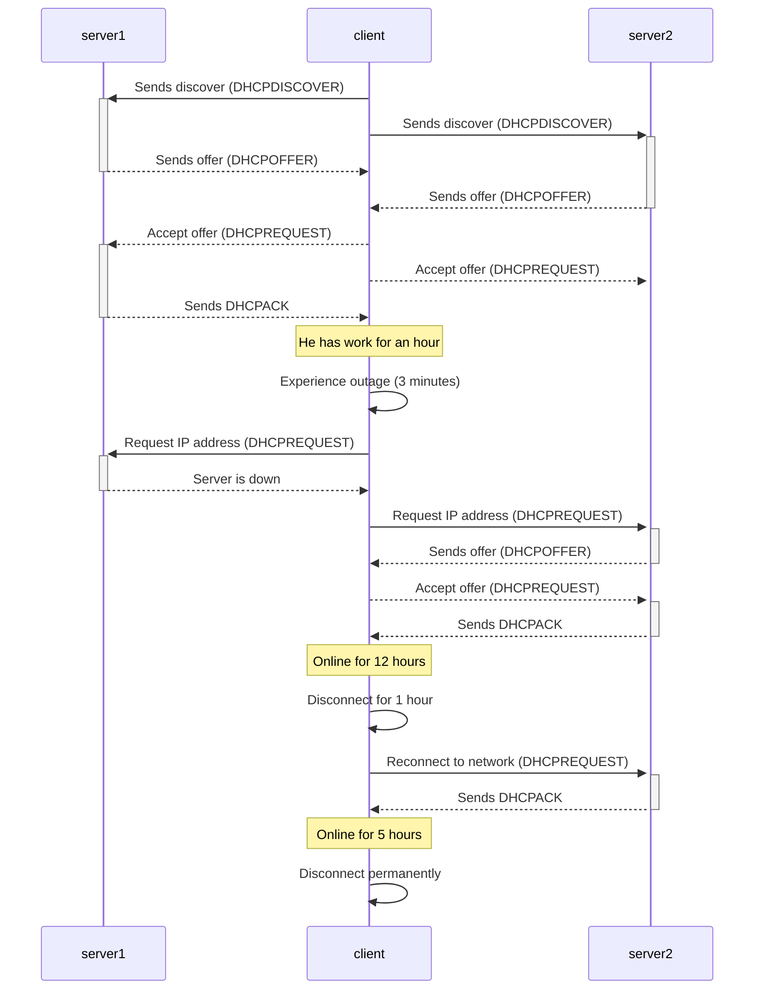

# Assigment-1-DHCP-Schema

```mermaid
sequenceDiagram


   participant server1
   participant client
   participant server2


   client->>+server1: Sends discover (DHCPDISCOVER)
   client->>+server2: Sends discover (DHCPDISCOVER)
   server1-->>-client: Sends offer (DHCPOFFER)
   server2-->>-client: Sends offer (DHCPOFFER)
   client-->>+server1: Accept offer (DHCPREQUEST)
   client-->>+server2: Accept offer (DHCPREQUEST)
   server1-->>-client: Sends DHCPACK


   note over client: He has work for an hour


   client->>client: Experience outage (3 minutes)
   client->>+server1: Request IP address (DHCPREQUEST)
   server1-->>-client: Server is down
   client->>+server2: Request IP address (DHCPREQUEST)
   server2-->>-client: Sends offer (DHCPOFFER)
   client-->>+server2: Accept offer (DHCPREQUEST)
   server2-->>-client: Sends DHCPACK


   note over client: Online for 12 hours


   client->>client: Disconnect for 1 hour
   client->>+server2: Reconnect to network (DHCPREQUEST)
   server2-->>-client: Sends DHCPACK
   note over client: Online for 5 hours


   client->>client: Disconnect permanently
```
